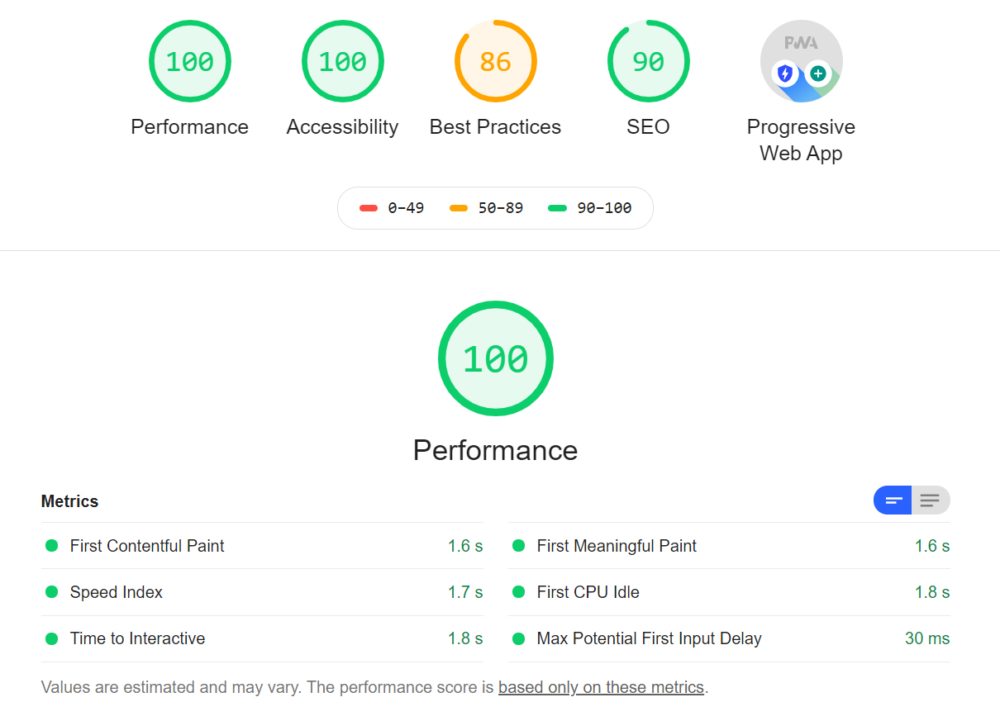

# Progressive-Budget

### Convert the solution from activity [26-Stu-Mini-Project](../../17-NoSQL/01-Activities/26-Stu-Mini-Project/README.md) with the following:

This was a class assigment for the UNH/Trilogy Foll Stack Bootcamp. We were given a set of files written for node, then we were to convert the files to a PWA, then deploy it to heroku connected with mongoDB.

It was an exercise to make sure we could implement manifest.webmanifest as well as serviceworker.jas and implement a compression library.

Lighhouse testing revealed a good app:

### Submission:

Github Repo -
https://github.com/whoerman/Progressive-Budget

Heroku Deployment
https://mysterious-gorge-00794.herokuapp.com/